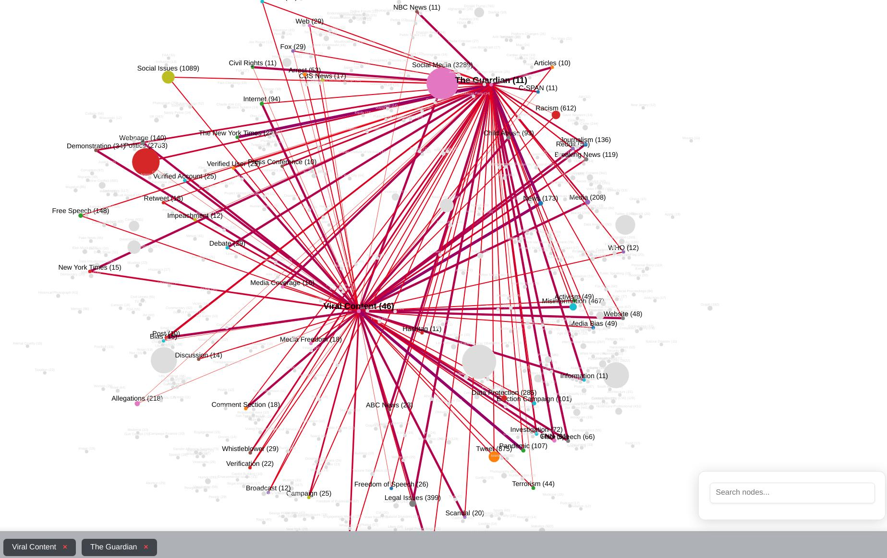
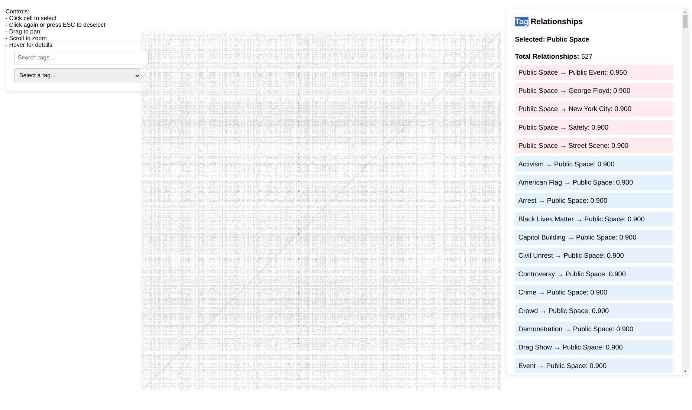
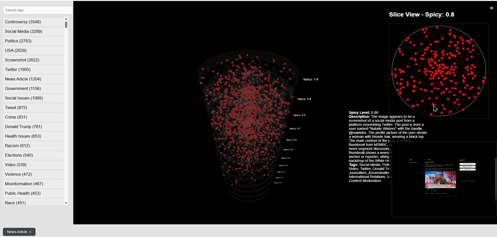

# 🔍 RedPill Explorer 🧠

## AI-Driven Content Archival & Organization System

## 🌟 Overview

RedPill Explorer is a comprehensive tool for archiving, analyzing, and exploring digital content (currently images) using AI-powered description, tagging, and visualization. The system processes content to create searchable, browsable collections with advanced visualization tools.

## ✨ Features

- 🤖 **AI-Powered Description**: Uses CogVLM2 to generate detailed descriptions of images
- 🏷️ **Automatic Tagging**: LLM-based tagging system with relevance scores
- 🌶️ **Content Rating**: "Spicyness" classification from 0.0 to 1.0 based on content sensitivity
- 📊 **Tag Association Matrix**: Visual representation of tag relationships
- 🕸️ **Dynamic Node Graph**: Interactive 2D visualization of content relationships
- 🔍 **Realtime Search**: Find content by typing words that appear in descriptions
- 🧩 **3D Spicyness Visualization**: Browse content based on sensitivity level in a 3D interface

## 🚀 How It Works

### Current Pipeline:

1. Content is sent to a dedicated archival bot (currently Telegram, separate project)
2. CogVLM2 generates detailed descriptions stored in FAISS vector database
3. LLM processes descriptions to generate tags and rate content sensitivity
4. Tag relationships are calculated automatically creating a weighted matrix
5. Multiple visualization tools provide different ways to explore the content

## 💻 Architecture

- **Backend**: Node.js Express server with Python processing scripts
- **Database**: FAISS vector database for similarity search
- **AI Models**: Self-hosted CogVLM2 and LLM
- **Visualization**: Interactive web interfaces with Three.js for 3D visualization

## 🔮 Future Plans

- 👤 Face recognition to extract and categorize people as actors
- 📝 Enhanced descriptive text and deep search capabilities
- 🔄 Improved automation of content ingestion
- 🧠 Exploration of multimodal models as alternatives to the current CogVLM2 + LLM approach. More GPUs and better models. (Currently using just a 4-bit quant of llama 3.1 and 3.2)
- 🔍 General purpose filesystem browsing and deepsearch

## 🛠️ Tech Stack

- **Backend**: Node.js, Express, Python
- **AI**: CogVLM2, FAISS Vector DB, LLM
- **Frontend**: JavaScript, HTML5, CSS3, Three.js
- **Visualization**: D3.js, Three.js

## 📋 Project Structure

- `server.js` - Main Express server handling API requests and serving content
- `hashMapper.js` - Maps content hashes to filesystem paths
- `caption_images_with_cogvlm2.py` - Processes images with CogVLM2 for descriptions
- `tag_caption_output.py` - Processes descriptions to generate tags and spicyness ratings
- `assign_weights.py` - Calculates association weights between tags
- `public/` - Web interface files for various visualizations
  - `concept-map.html` - Tag relationship visualization
  - `matrix.html` - Tag association matrix view
  - `spicy.html` - 3D spicyness visualization

## 📊 Visualizations

### 2D Graph
Dynamic nodes represent tags and associated content with interactive search and filtering.

### Association Matrix
Visual representation of tag relationships and their weighted connections.

### 3D Spicyness View
Content sliced by sensitivity from 0.0 to 1.0 in a three-dimensional interface with dynamic node population.

## 🔧 Development

The project is designed to be self-hosted with separate services for:
- Content storage and retrieval
- AI description generation
- Tag processing and association
- Web-based visualization

## 🎯 Purpose (i.e., what's wrong with you?)

This project was created to archive potentially disappearing or censored content and organize it in a meaningful, searchable way using local AI technologies. I do wish to apply it more broadly to all digital content I've stored, including documents, family photos, etc., or perhaps integrate it into Immich, which already does facial recognition. I think deep-search of content will be the primary way of retrieving your past information